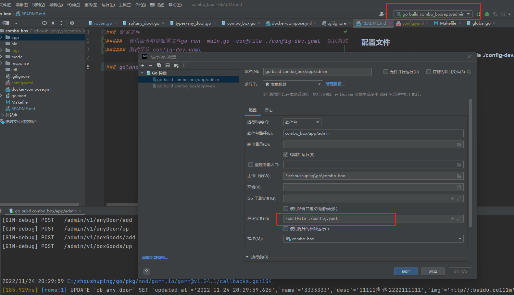

### 使用手册

### 拉取依赖需要的设置的参数
#### go env -w GO111MODULE=on

#### 目录说明
common --  服务启动的入口   
config --  配置 加载配置文件 nacos 加载配置  
middlewares 中间件  
initialize 初始化服务   
registry   服务发现  
response   统一接口响应返回格式  
utils      工具

***
### 配置文件
#####  使用命令指定配置文件go run  main.go -confFile ./config-dev.yaml  默认格式 ./config.yaml
###### 测试环境 config-dev.yaml

### goland 配置



### 使用配置

### 服务启动
#### 默认服务启动 mysql redis log jaeger
```
func main() {
    //加载配置
	if err := initialize.Config(true, global.Config); err != nil {
		log.Fatalf("加载配置失败 err:%s", err.Error())
	}
	
	//启动默认服务 mysql redis zaplog jaeger
	global.Srv, err = initialize.DefaultServices()
	if err != nil {
		log.Fatalf("服务启动失败 err:%s", err.Error())
	}
	
	common.Run(router.Init(), global.Srv)
}

```

#### 自定义服务启动 
```
    //加载配置
	if err := initialize.Config(true, global.Config); err != nil {
		log.Fatalf("加载配置失败 err:%s", err.Error())
	}
	
	global.Srv, err = initialize.Start(initialize.Mysql()) 
	if err != nil {
		log.Fatalf("服务启动失败 err:%s", err.Error())
	}
	
	common.Run(router.Init(), global.Srv)
```